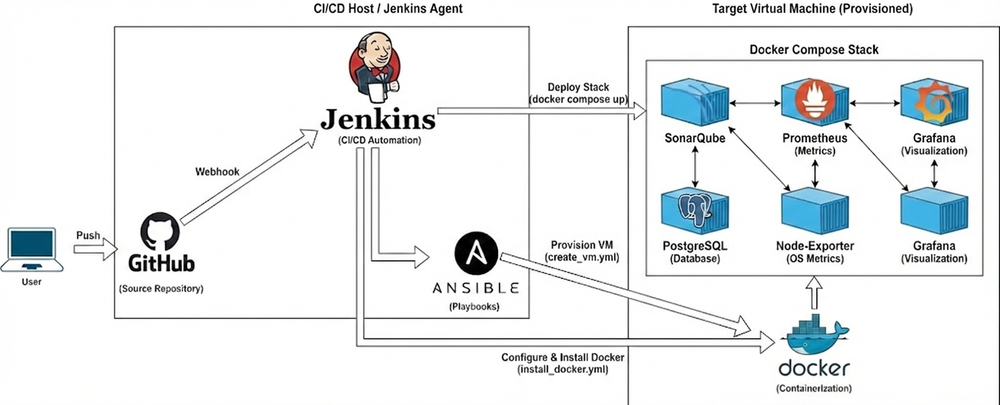

# DevOps Observability Stack

## Overview
DevOps Observability Stack is a fully automated monitoring and code quality platform. It leverages Infrastructure as Code (IaC) principles to provision a virtual environment and deploy a resilient stack containing Prometheus, Grafana, and SonarQube using Docker Compose.

The goal is to provide a "push-button" solution for spinning up a complete observability lab, ensuring consistency across environments through automation.


## Architecture

The project follows a strict separation of concerns:

- Provisioning: Ansible creates the Virtual Machine (VirtualBox).

- Configuration: Ansible configures the OS and installs the Docker Engine.

- Orchestration: Jenkins pipelines orchestrate the flow.

- Application: Docker Compose manages the services (Monitor & Quality) inside the VM.

Service Stack

- Prometheus: Metrics collection and storage.

- Node Exporter: Hardware and OS metrics exposure.

- Grafana: Visualization with automated dashboard provisioning.

- SonarQube: Continuous Code Quality inspection.

- PostgreSQL: Database backend for SonarQube.



## 🚀 Getting Started

Prerequisites:

- Jenkins installed and running.

- VirtualBox installed on the host machine.

- Ansible installed.

Installation & Deployment
This project is designed to run via the Jenkins Pipeline, but the logic can be broken down:

1. **Infrastructure Provisioning:** The pipeline triggers ansible-playbook create_vm.yml to spin up a fresh Ubuntu VM.
2. **IConfiguration Management:** The pipeline triggers ansible-playbook install_docker.yml to prepare the VM with Docker Engine and Compose plugin.

3. **IStack Deployment:** The pipeline transfers the docker-compose-stack.yml and monitoring/ configs to the VM and executes:
```bash
docker compose -f docker-compose-stack.yml up -d
```
Accessing the Services
Once the pipeline finishes, you can access the services via the VM IP:

| Service | Port | Default Creds |
| :--- | :--- | :--- |
| **Grafana** | 3000 | admin / admin |
| **Prometheus** | 9090 | N/A |
| **SonarQube** | 9000 | admin / admin |

## 📊 Features & Automation Highlights

- Idempotency: Ansible playbooks ensure the state of the VM is always consistent.

- Grafana Provisioning: Dashboards and Datasources are injected via code (monitoring/grafana/provisioning). No manual import is required.

- Persistent Data: Docker volumes ensure SonarQube and Prometheus data survive container restarts.

- Isolation: All services run in a dedicated Docker network (infra-net).

## 📄 License
Distributed under the MIT License. See LICENSE for more information.